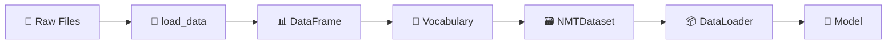
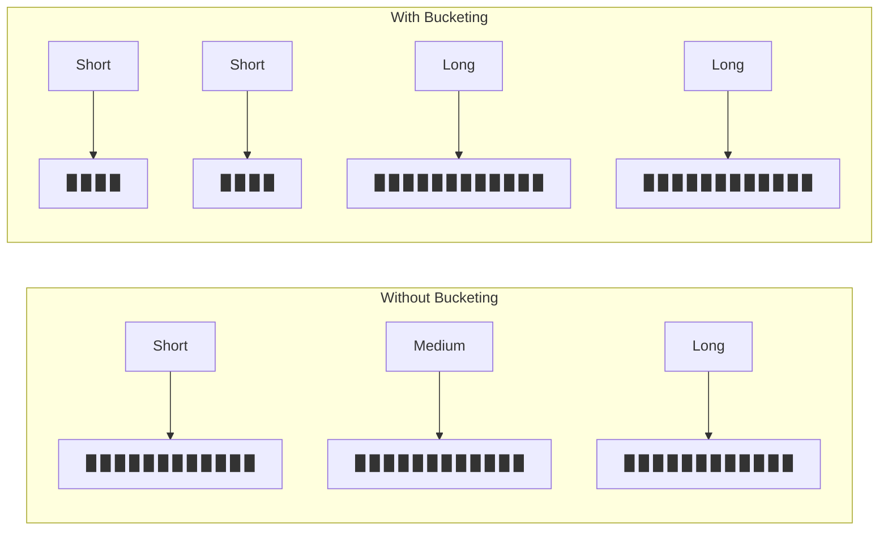

# Data Pipeline

Understanding how data flows through TorchLingo is essential for debugging and customization. This page traces data from raw text files to model-ready tensors.

## The Big Picture


```mermaid
flowchart LR
    A[📁 Raw Files] --> B[🔄 load_data]
    B --> C[📊 DataFrame]
    C --> D[📖 Vocabulary]
    D --> E[🗃️ NMTDataset]
    E --> F[📦 DataLoader]
    F --> G[🧠 Model]
```

Let's explore each step.

## Step 1: Raw Data Formats

TorchLingo supports multiple input formats. All must have `src` and `tgt` columns:

=== "TSV (Recommended)"

    ```tsv
    src	tgt
    Hello world	Hola mundo
    Good morning	Buenos días
    ```
    
    - Tab-separated
    - Simple and human-readable
    - Works well with version control

=== "CSV"

    ```csv
    src,tgt
    "Hello, world","Hola, mundo"
    Good morning,Buenos días
    ```
    
    - Comma-separated
    - Requires quoting if text contains commas

=== "JSON Lines"

    ```json
    {"src": "Hello world", "tgt": "Hola mundo"}
    {"src": "Good morning", "tgt": "Buenos días"}
    ```
    
    - One JSON object per line
    - Good for complex metadata

=== "Parquet"

    Binary format, not human-readable.
    
    - Best for large datasets
    - Compressed and fast to load
    - Great for production

### Converting Parallel Text Files

If you have separate source and target files (common format):

```python
from torchlingo.preprocessing import parallel_txt_to_dataframe

# english.txt and spanish.txt must have the same number of lines
df = parallel_txt_to_dataframe(
    src_path="english.txt",
    tgt_path="spanish.txt"
)

# Save as TSV for future use
df.to_csv("data.tsv", sep="\t", index=False)
```

## Step 2: Loading Data

The `load_data` function handles all supported formats:

```python
from torchlingo.preprocessing import load_data

# Format is auto-detected from extension
df = load_data("data/train.tsv")
print(df.head())
```

```
                src                tgt
0      Hello world         Hola mundo
1    Good morning!      ¡Buenos días!
2  How are you?     ¿Cómo estás?
```

Under the hood:

```python
def load_data(filepath, format=None):
    """Auto-detect format and load appropriately."""
    if format == "tsv":
        return pd.read_csv(filepath, sep="\t")
    elif format == "csv":
        return pd.read_csv(filepath)
    elif format == "parquet":
        return pd.read_parquet(filepath)
    elif format == "json":
        return pd.read_json(filepath, lines=True)
```

## Step 3: Data Cleaning

`NMTDataset` automatically cleans your data:

```python
from torchlingo.data_processing import NMTDataset

dataset = NMTDataset("data/train.tsv")
```

What happens during cleaning:

1. **Fill NaN values** → Empty strings
2. **Strip whitespace** → Remove leading/trailing spaces
3. **Drop empty rows** → Remove pairs where either side is blank
4. **Convert to strings** → Ensure consistent types

!!! tip "Inspect Your Data"
    ```python
    print(f"Loaded {len(dataset)} samples")
    print(f"Sample 0: {dataset.src_sentences[0]} → {dataset.tgt_sentences[0]}")
    ```

### Cleaning is not the same as checking

Every step above is *structural*. It fixes types, whitespace and blank rows. Not one
of them asks the question that matters most about a parallel corpus:

**Is row `n` of the source side actually a translation of row `n` of the target side?**

This is not a hypothetical concern. The corpus shipped with this library was once
misaligned in exactly that way. Its two columns were independent documents zipped
together, so no row was a translation of its partner. It passed every check above: two
columns, correct types, no blank rows, plausible sentences on both sides.

A student who trained on it would have watched the loss refuse to fall, with no way to
tell bad data from a mistake of their own. That is the worst thing a corpus can do in a
teaching library, and it is worth knowing how to detect.

#### Two cheap checks

Both rest on properties that hold for translations and fail for unrelated text. Neither
needs a model, a second language, or more than a few seconds.

**Sentence lengths correlate.** A translation is about as long as its source. Not
exactly, and the ratio varies by language pair, but strongly enough to be obvious in
aggregate.

**Names and numbers survive translation.** "Stephen Palumbi" and "2010" appear on both
sides of a real pair. They are not translated, so you can compare them without knowing
either language.

```python
import pandas as pd
from torchlingo.preprocessing import diagnose_alignment

frame = pd.read_csv("data/example.tsv", sep="\t")
report = diagnose_alignment(frame)

print(report.length_correlation)   # 0.97 for parallel text
print(report.anchor_agreement)     # 0.41 on this corpus
print(report.looks_aligned())      # True
```

#### What the numbers look like

Run on the shipped corpus, and again on the same file with the target side rotated by
one row so that no pair is a translation of itself:

--8<-- "docs/_generated/alignment_diagnosis.md"

The right-hand column is what a broken corpus looks like. Nothing about its *shape*
differs from the left.

!!! warning "Run both, and know what they miss"
    Neither check is proof, and each has a blind spot the other covers.

    The anchor check compares *which* names and numbers the two sides share, so a token
    appearing in nearly every row carries no signal. A single speaker's name, repeated
    throughout their own talks, is shared by every pairing whether that pairing is right
    or wrong. Scramble such a corpus and agreement stays at 100% while the length
    correlation collapses.

    A corpus whose sentences are mostly the same length has the opposite problem.

    They are smoke detectors: cheap, and loud about the failure that actually happened.
    A corpus can pass both and still be subtly misaligned, and a legitimately noisy
    corpus can score lower without being broken. Look at the numbers, then look at some
    rows.

#### Checking your own data

`diagnose_alignment` takes any DataFrame with a source and a target column, so point it
at your own corpus before you spend an afternoon training on it:

```python
report = diagnose_alignment(my_frame, src_col="english", tgt_col="spanish")
if not report.looks_aligned():
    print(f"suspicious: {report}")
```

To see the checks fail on data you know is good, break it yourself:

```python
from torchlingo.preprocessing import shuffle_target_side

broken = shuffle_target_side(frame)
print(diagnose_alignment(broken).looks_aligned())   # False
```

That is worth doing once. A check you have never seen fail is a check you do not yet
know how to read.

### Repairing a corpus that is only slightly wrong

Detecting misalignment is one thing. Deciding what to do about it is another, and the
answer depends on *how* wrong the data is.

This corpus came as 662 talks present in both languages. For 564 of them, the two
transcripts had been split into the same number of sentences, so pairing them by
position is safe. For the remaining 98, the segmentation differed slightly — usually by
a single line, at most by nineteen. A translator merged two sentences, or dropped a
stage direction the other transcript kept.

Those 98 are not garbage. They are about 13,000 sentence pairs, roughly 18% more data,
and throwing them away is expensive. But pairing them by position is exactly the
mistake that produced the broken corpus in the first place: after one missing line,
every later sentence pairs with its neighbour instead of its translation.

#### Align by length, not by position

The fix is the same observation the length check rests on: **a translation is about as
long as its source.** If sentence 4 on one side is twice as long as sentence 4 on the
other, but matches sentence 5 well, the two sides have probably slipped by one.

Turn that into a cost and finding the best alignment becomes a shortest-path problem.
This is [Gale and Church (1993)](https://aclanthology.org/J93-1004/), and if you have
met edit distance you already know its shape: a table, a small set of allowed moves, and
a cost per move.

| Move | Meaning |
|---|---|
| 1-1 | One sentence translates one sentence. The common case, so it is free. |
| 1-2, 2-1 | A sentence was split, or two were merged. |
| 1-0, 0-1 | A sentence has no counterpart. |
| 2-2 | Two sentences rearranged into two others. |

Each move costs a fixed penalty plus a measure of how improbable its length ratio is,
and dynamic programming finds the cheapest path through both documents at once.

```python
from torchlingo.preprocessing import align_one_to_one

pairs = align_one_to_one(source_sentences, target_sentences)
```

`align_one_to_one` keeps only the 1-1 beads. A split or a dropped sentence is
*discarded*, not guessed at, which is the conservative reading of the same principle
that runs through this page.

#### Does it work?

The honest test is not whether the realigned data looks fine. It is whether it beats
the naive thing, measured the same way:

--8<-- "docs/_generated/realign_report.md"

Read that table twice. Pairing by position produces **more** data and it is wrong: 0.56
correlation is far below the 0.97 of genuinely parallel text, and it fails the check
from the previous section. The aligner gives up 153 pairs and lands at 0.97, which is
indistinguishable from the corpus that never needed repair.

That is the loop worth remembering. The checks from the previous section are not just
documentation — they are the acceptance test for the repair, and
`scripts/realign_corpus.py` **refuses to write the corpus** if the realigned rows do
not clear them.

!!! note "Where this runs out"
    Gale and Church use length alone, which is why it needs no dictionary and works on
    any language pair. It is also why it can only fix *drift*. If two documents are not
    translations of each other at all, no alignment of them is correct, and the
    algorithm will still return its cheapest path. Run the checks on the result; that
    is what they are for.

    A corpus with many long omissions is the harder case: the cost model treats a long
    deletion as so improbable that a poor one-to-one can score better. It resynchronizes
    afterwards, but emits one bad pair at the gap.

    The known fix is to stop relying on length alone.
    [Moore (2002)](https://aclanthology.org/2002.amta-papers.14/) aligns in two passes:
    a length-based pass like this one, whose confident pairs then train an IBM Model 1
    word-translation model, and a second pass scoring both length *and* word
    correspondence. Lexical evidence settles exactly the case length cannot, because a
    dropped sentence shares no words with anything. TorchLingo does not implement this;
    length alone was enough here, and you can see that in the table above.

## Step 4: Building Vocabularies

If you don't provide pre-built vocabularies, `NMTDataset` creates them:

```python
# Vocabularies are built automatically
dataset = NMTDataset("data/train.tsv")

# Access them
src_vocab = dataset.src_vocab
tgt_vocab = dataset.tgt_vocab

print(f"Source vocabulary: {len(src_vocab)} tokens")
print(f"Target vocabulary: {len(tgt_vocab)} tokens")
```

### Vocabulary Configuration

Control vocabulary building via `Config`:

```python
from torchlingo.config import Config

config = Config(
    min_freq=2,  # Ignore words appearing less than 2 times
)

dataset = NMTDataset("data/train.tsv", config=config)
```

### Sharing Vocabularies

For multilingual models or shared vocabs:

```python
# Train vocabulary on training data
train_dataset = NMTDataset("data/train.tsv")

# Reuse for validation/test
val_dataset = NMTDataset(
    "data/val.tsv",
    src_vocab=train_dataset.src_vocab,
    tgt_vocab=train_dataset.tgt_vocab,
)
```

!!! warning "Always use training vocabulary"
    Using validation/test data to build vocabulary causes **data leakage**. Always build vocab on training data only.

## Step 5: Encoding Sentences

When you access a sample, text is converted to tensor indices:

```python
src_tensor, tgt_tensor = dataset[0]

print(f"Source: {dataset.src_sentences[0]}")
print(f"Encoded: {src_tensor.tolist()}")
```

```
Source: Hello world
Encoded: [2, 45, 123, 3]  # [SOS, Hello, world, EOS]
```

### Special Tokens

Every sequence includes special tokens:

| Token   | Index | Position | Purpose                    |
| ------- | ----- | -------- | -------------------------- |
| `<sos>` | 2     | Start    | Signals sequence beginning |
| `<eos>` | 3     | End      | Signals sequence end       |
| `<pad>` | 0     | Filler   | Makes sequences same length |
| `<unk>` | 1     | N/A      | Replaces unknown words     |

### Handling Long Sequences

Sequences longer than `max_length` are truncated:

```python
config = Config(max_seq_length=100)
dataset = NMTDataset("data/train.tsv", config=config)

# Sequences longer than 100 tokens are cut to 99 + EOS
```

## Step 6: Batching with DataLoader

PyTorch's `DataLoader` groups samples into batches:

```python
from torch.utils.data import DataLoader
from torchlingo.data_processing import collate_fn

loader = DataLoader(
    dataset,
    batch_size=32,
    shuffle=True,           # Shuffle for training
    collate_fn=collate_fn,  # Handles variable-length padding
)

for src_batch, tgt_batch in loader:
    print(f"Source batch shape: {src_batch.shape}")  # [32, max_src_len]
    print(f"Target batch shape: {tgt_batch.shape}")  # [32, max_tgt_len]
    break
```

### The collate_fn

Sentences have different lengths, but tensors must be rectangular. `collate_fn` pads shorter sequences:

```python
# Before collate (variable lengths):
[
    [2, 5, 6, 3],           # "Hello world"
    [2, 7, 8, 9, 10, 3],    # "How are you today"
    [2, 11, 3],             # "Hi"
]

# After collate (padded to same length):
[
    [2, 5,  6,  0,  0, 3],  # Padded with 0s
    [2, 7,  8,  9, 10, 3],  # No padding needed
    [2, 11, 0,  0,  0, 3],  # Padded with 0s
]
```

## Step 7: Bucketed Batching (Advanced)

For efficiency, group similar-length sequences together:

```python
from torchlingo.data_processing import BucketBatchSampler, create_dataloaders

# Automatic bucket boundaries
train_loader, val_loader = create_dataloaders(
    train_file="data/train.tsv",
    val_file="data/val.tsv",
    batch_size=32,
    use_bucketing=True,
)
```

Benefits:

- **Less wasted computation** on padding
- **Better GPU utilization**
- **Faster training**


```mermaid
flowchart LR
    subgraph Without Bucketing
        A1[Short] --> B1[█ █ █ █ █ █ █ █ █ █ █ █]
        A2[Medium] --> B2[█ █ █ █ █ █ █ █ █ █ █ █]
        A3[Long] --> B3[█ █ █ █ █ █ █ █ █ █ █ █]
    end
    
    subgraph With Bucketing
        C1[Short] --> D1[█ █ █ █]
        C2[Short] --> D2[█ █ █ █]
        C3[Long] --> D3[█ █ █ █ █ █ █ █ █ █ █ █]
        C4[Long] --> D4[█ █ █ █ █ █ █ █ █ █ █ █]
    end
```

## Complete Example

Here's the full data pipeline:

```python
from torchlingo.config import Config
from torchlingo.data_processing import NMTDataset, create_dataloaders

# Configure
config = Config(
    batch_size=32,
    max_seq_length=128,
    min_freq=2,
)

# Create dataset
train_dataset = NMTDataset("data/train.tsv", config=config)

# Create data loaders
train_loader, val_loader = create_dataloaders(
    train_file="data/train.tsv",
    val_file="data/val.tsv",
    src_vocab=train_dataset.src_vocab,
    tgt_vocab=train_dataset.tgt_vocab,
    config=config,
)

# Ready for training!
for src_batch, tgt_batch in train_loader:
    # src_batch: [batch_size, src_seq_len]
    # tgt_batch: [batch_size, tgt_seq_len]
    pass
```

## Common Issues

??? question "ValueError: Data file must contain columns 'src' and 'tgt'"
    Your file doesn't have the expected column names. Either:
    
    1. Rename columns in your file, or
    2. Specify custom column names:
    ```python
    dataset = NMTDataset("data.tsv", src_col="english", tgt_col="spanish")
    ```

??? question "Why is my vocabulary so large?"
    Large vocabularies often indicate:
    
    - Typos or noise in your data
    - No tokenization preprocessing
    - `min_freq` set too low
    
    Try:
    ```python
    config = Config(min_freq=5)  # Require words appear 5+ times
    ```

??? question "Out of memory when loading data"
    For very large datasets:
    
    1. Use Parquet format (more memory efficient)
    2. Load in chunks (not yet built into TorchLingo)
    3. Subsample for initial experiments

## Next Steps

Now that you understand the data pipeline, learn about:

[Vocabulary & Tokenization :material-arrow-right:](vocabulary.md){ .md-button .md-button--primary }
