# Data Pipeline

Understanding how data flows through TorchLingo is essential for debugging and customization. This page traces data from raw text files to model-ready tensors.

## The Big Picture

```mermaid
flowchart LR
    A[📁 Raw Files] --> B[🔄 load_data]
    B --> C[📊 DataFrame]
    C --> D[📖 Vocabulary]
    D --> E[🗃️ NMTDataset]
    E --> F[📦 DataLoader]
    F --> G[🧠 Model]
```



Let's explore each step.

## Step 1: Raw Data Formats

TorchLingo supports multiple input formats. All must have `src` and `tgt` columns:

=== "TSV (Recommended)"

    ```tsv
    src	tgt
    Hello world	Hola mundo
    Good morning	Buenos días
    ```
    
    - Tab-separated
    - Simple and human-readable
    - Works well with version control

=== "CSV"

    ```csv
    src,tgt
    "Hello, world","Hola, mundo"
    Good morning,Buenos días
    ```
    
    - Comma-separated
    - Requires quoting if text contains commas

=== "JSON Lines"

    ```json
    {"src": "Hello world", "tgt": "Hola mundo"}
    {"src": "Good morning", "tgt": "Buenos días"}
    ```
    
    - One JSON object per line
    - Good for complex metadata

=== "Parquet"

    Binary format, not human-readable.
    
    - Best for large datasets
    - Compressed and fast to load
    - Great for production

### Converting Parallel Text Files

If you have separate source and target files (common format):

```python
from torchlingo.preprocessing import parallel_txt_to_dataframe

# english.txt and spanish.txt must have the same number of lines
df = parallel_txt_to_dataframe(
    src_path="english.txt",
    tgt_path="spanish.txt"
)

# Save as TSV for future use
df.to_csv("data.tsv", sep="\t", index=False)
```

## Step 2: Loading Data

The `load_data` function handles all supported formats:

```python
from torchlingo.preprocessing import load_data

# Format is auto-detected from extension
df = load_data("data/train.tsv")
print(df.head())
```

```
                src                tgt
0      Hello world         Hola mundo
1    Good morning!      ¡Buenos días!
2  How are you?     ¿Cómo estás?
```

Under the hood:

```python
def load_data(filepath, format=None):
    """Auto-detect format and load appropriately."""
    if format == "tsv":
        return pd.read_csv(filepath, sep="\t")
    elif format == "csv":
        return pd.read_csv(filepath)
    elif format == "parquet":
        return pd.read_parquet(filepath)
    elif format == "json":
        return pd.read_json(filepath, lines=True)
```

## Step 3: Data Cleaning

`NMTDataset` automatically cleans your data:

```python
from torchlingo.data_processing import NMTDataset

dataset = NMTDataset("data/train.tsv")
```

What happens during cleaning:

1. **Fill NaN values** → Empty strings
2. **Strip whitespace** → Remove leading/trailing spaces
3. **Drop empty rows** → Remove pairs where either side is blank
4. **Convert to strings** → Ensure consistent types

!!! tip "Inspect Your Data"
    ```python
    print(f"Loaded {len(dataset)} samples")
    print(f"Sample 0: {dataset.src_sentences[0]} → {dataset.tgt_sentences[0]}")
    ```

## Step 4: Building Vocabularies

If you don't provide pre-built vocabularies, `NMTDataset` creates them:

```python
# Vocabularies are built automatically
dataset = NMTDataset("data/train.tsv")

# Access them
src_vocab = dataset.src_vocab
tgt_vocab = dataset.tgt_vocab

print(f"Source vocabulary: {len(src_vocab)} tokens")
print(f"Target vocabulary: {len(tgt_vocab)} tokens")
```

### Vocabulary Configuration

Control vocabulary building via `Config`:

```python
from torchlingo.config import Config

config = Config(
    min_freq=2,  # Ignore words appearing less than 2 times
)

dataset = NMTDataset("data/train.tsv", config=config)
```

### Sharing Vocabularies

For multilingual models or shared vocabs:

```python
# Train vocabulary on training data
train_dataset = NMTDataset("data/train.tsv")

# Reuse for validation/test
val_dataset = NMTDataset(
    "data/val.tsv",
    src_vocab=train_dataset.src_vocab,
    tgt_vocab=train_dataset.tgt_vocab,
)
```

!!! warning "Always use training vocabulary"
    Using validation/test data to build vocabulary causes **data leakage**. Always build vocab on training data only.

## Step 5: Encoding Sentences

When you access a sample, text is converted to tensor indices:

```python
src_tensor, tgt_tensor = dataset[0]

print(f"Source: {dataset.src_sentences[0]}")
print(f"Encoded: {src_tensor.tolist()}")
```

```
Source: Hello world
Encoded: [2, 45, 123, 3]  # [SOS, Hello, world, EOS]
```

### Special Tokens

Every sequence includes special tokens:

| Token   | Index | Position | Purpose                    |
| ------- | ----- | -------- | -------------------------- |
| `<sos>` | 2     | Start    | Signals sequence beginning |
| `<eos>` | 3     | End      | Signals sequence end       |
| `<pad>` | 0     | Filler   | Makes sequences same length |
| `<unk>` | 1     | N/A      | Replaces unknown words     |

### Handling Long Sequences

Sequences longer than `max_length` are truncated:

```python
config = Config(max_seq_length=100)
dataset = NMTDataset("data/train.tsv", config=config)

# Sequences longer than 100 tokens are cut to 99 + EOS
```

## Step 6: Batching with DataLoader

PyTorch's `DataLoader` groups samples into batches:

```python
from torch.utils.data import DataLoader
from torchlingo.data_processing import collate_fn

loader = DataLoader(
    dataset,
    batch_size=32,
    shuffle=True,           # Shuffle for training
    collate_fn=collate_fn,  # Handles variable-length padding
)

for src_batch, tgt_batch in loader:
    print(f"Source batch shape: {src_batch.shape}")  # [32, max_src_len]
    print(f"Target batch shape: {tgt_batch.shape}")  # [32, max_tgt_len]
    break
```

### The collate_fn

Sentences have different lengths, but tensors must be rectangular. `collate_fn` pads shorter sequences:

```python
# Before collate (variable lengths):
[
    [2, 5, 6, 3],           # "Hello world"
    [2, 7, 8, 9, 10, 3],    # "How are you today"
    [2, 11, 3],             # "Hi"
]

# After collate (padded to same length):
[
    [2, 5,  6,  0,  0, 3],  # Padded with 0s
    [2, 7,  8,  9, 10, 3],  # No padding needed
    [2, 11, 0,  0,  0, 3],  # Padded with 0s
]
```

## Step 7: Bucketed Batching (Advanced)

For efficiency, group similar-length sequences together:

```python
from torchlingo.data_processing import BucketBatchSampler, create_dataloaders

# Automatic bucket boundaries
train_loader, val_loader = create_dataloaders(
    train_file="data/train.tsv",
    val_file="data/val.tsv",
    batch_size=32,
    use_bucketing=True,
)
```

Benefits:

- **Less wasted computation** on padding
- **Better GPU utilization**
- **Faster training**

```mermaid
flowchart LR
    subgraph Without Bucketing
        A1[Short] --> B1[█ █ █ █ █ █ █ █ █ █ █ █]
        A2[Medium] --> B2[█ █ █ █ █ █ █ █ █ █ █ █]
        A3[Long] --> B3[█ █ █ █ █ █ █ █ █ █ █ █]
    end
    
    subgraph With Bucketing
        C1[Short] --> D1[█ █ █ █]
        C2[Short] --> D2[█ █ █ █]
        C3[Long] --> D3[█ █ █ █ █ █ █ █ █ █ █ █]
        C4[Long] --> D4[█ █ █ █ █ █ █ █ █ █ █ █]
    end
```



## Complete Example

Here's the full data pipeline:

```python
from torchlingo.config import Config
from torchlingo.data_processing import NMTDataset, create_dataloaders

# Configure
config = Config(
    batch_size=32,
    max_seq_length=128,
    min_freq=2,
)

# Create dataset
train_dataset = NMTDataset("data/train.tsv", config=config)

# Create data loaders
train_loader, val_loader = create_dataloaders(
    train_file="data/train.tsv",
    val_file="data/val.tsv",
    src_vocab=train_dataset.src_vocab,
    tgt_vocab=train_dataset.tgt_vocab,
    config=config,
)

# Ready for training!
for src_batch, tgt_batch in train_loader:
    # src_batch: [batch_size, src_seq_len]
    # tgt_batch: [batch_size, tgt_seq_len]
    pass
```

## Common Issues

??? question "ValueError: Data file must contain columns 'src' and 'tgt'"
    Your file doesn't have the expected column names. Either:
    
    1. Rename columns in your file, or
    2. Specify custom column names:
    ```python
    dataset = NMTDataset("data.tsv", src_col="english", tgt_col="spanish")
    ```

??? question "Why is my vocabulary so large?"
    Large vocabularies often indicate:
    
    - Typos or noise in your data
    - No tokenization preprocessing
    - `min_freq` set too low
    
    Try:
    ```python
    config = Config(min_freq=5)  # Require words appear 5+ times
    ```

??? question "Out of memory when loading data"
    For very large datasets:
    
    1. Use Parquet format (more memory efficient)
    2. Load in chunks (not yet built into TorchLingo)
    3. Subsample for initial experiments

## Next Steps

Now that you understand the data pipeline, learn about:

[Vocabulary & Tokenization :material-arrow-right:](vocabulary.md){ .md-button .md-button--primary }
