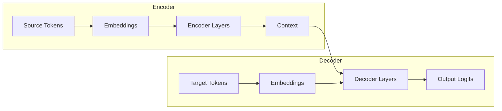
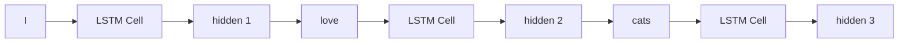
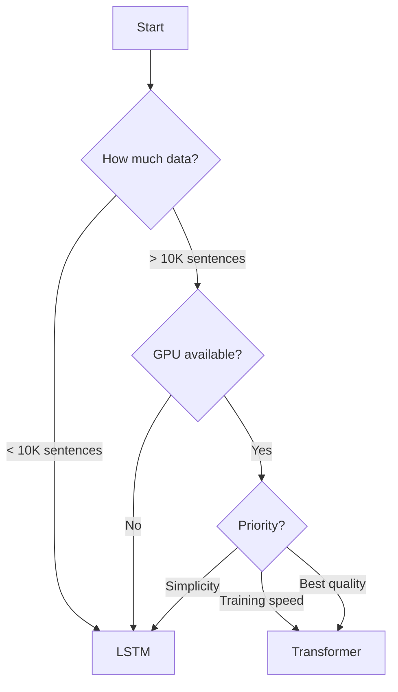

# Model Architectures

TorchLingo provides two sequence-to-sequence architectures: a classic **LSTM** model and a modern **Transformer**. This page explains how each works and when to use them.

## The Encoder-Decoder Framework

Both models follow the same high-level pattern:



The difference is in **how** the encoder and decoder process sequences.

## LSTM: The Classic Approach

### How LSTMs Work

**Long Short-Term Memory** networks process sequences one step at a time, maintaining a "hidden state" that accumulates information:

```
Step 1: Read "I"       → Update hidden state
Step 2: Read "love"    → Update hidden state  
Step 3: Read "cats"    → Update hidden state (now contains "I love cats")
```



### TorchLingo's SimpleSeq2SeqLSTM

```python
from torchlingo.models import SimpleSeq2SeqLSTM

model = SimpleSeq2SeqLSTM(
    src_vocab_size=10000,
    tgt_vocab_size=10000,
    emb_dim=256,      # Embedding dimension
    hidden_dim=512,   # LSTM hidden size
    num_layers=2,     # Stacked LSTM layers
    dropout=0.1,
)
```

### LSTM Architecture Diagram

```
┌─────────────────────────────────────────┐
│                ENCODER                  │
│  ┌───────────────────────────────────┐  │
│  │         Embedding Layer           │  │
│  │   src_vocab_size → emb_dim        │  │
│  └───────────────────────────────────┘  │
│                   ↓                     │
│  ┌───────────────────────────────────┐  │
│  │         LSTM Layers × N           │  │
│  │   emb_dim → hidden_dim            │  │
│  └───────────────────────────────────┘  │
│                   ↓                     │
│         (hidden_state, cell_state)      │
└─────────────────────────────────────────┘
                    ↓
┌─────────────────────────────────────────┐
│                DECODER                  │
│  ┌───────────────────────────────────┐  │
│  │         Embedding Layer           │  │
│  └───────────────────────────────────┘  │
│                   ↓                     │
│  ┌───────────────────────────────────┐  │
│  │         LSTM Layers × N           │  │
│  │  (initialized with encoder state) │  │
│  └───────────────────────────────────┘  │
│                   ↓                     │
│  ┌───────────────────────────────────┐  │
│  │         Linear Output             │  │
│  │   hidden_dim → tgt_vocab_size     │  │
│  └───────────────────────────────────┘  │
└─────────────────────────────────────────┘
```

### Pros and Cons

| Pros | Cons |
| ---- | ---- |
| ✅ Simple to understand | ❌ Sequential (slow to train) |
| ✅ Few hyperparameters | ❌ Hard to capture long-range dependencies |
| ✅ Works on small datasets | ❌ Information bottleneck in hidden state |

## Transformer: The Modern Standard

### The Attention Revolution

Transformers process the **entire sequence at once** using attention:

```
Query: "What word should I focus on?"
Keys:  [I, love, cats] 
Values: [embed(I), embed(love), embed(cats)]

Attention weights: [0.1, 0.3, 0.6]  ← Focus mostly on "cats"
Output: weighted combination of values
```

### Self-Attention Explained

Self-attention lets each position look at all other positions:

```python
# Simplified attention computation
Q = input @ W_q  # Query projection
K = input @ W_k  # Key projection  
V = input @ W_v  # Value projection

attention_weights = softmax(Q @ K.T / sqrt(d_k))
output = attention_weights @ V
```

For "I love cats", the word "love" can directly attend to both "I" and "cats".

### Multi-Head Attention

Instead of one attention pattern, use multiple "heads" that learn different relationships:

```
Head 1: Subject-verb relationships
Head 2: Adjective-noun relationships
Head 3: Syntactic patterns
...
```

### TorchLingo's SimpleTransformer

```python
from torchlingo.models import SimpleTransformer

model = SimpleTransformer(
    src_vocab_size=10000,
    tgt_vocab_size=10000,
    d_model=512,           # Model dimension
    n_heads=8,             # Attention heads
    num_encoder_layers=6,  # Encoder depth
    num_decoder_layers=6,  # Decoder depth
    d_ff=2048,             # Feed-forward dimension
    dropout=0.1,
)
```

### Transformer Architecture Diagram

```
┌───────────────────────────────────────────────┐
│                   ENCODER                     │
│  ┌─────────────────────────────────────────┐  │
│  │   Token Embedding + Positional Encoding │  │
│  └─────────────────────────────────────────┘  │
│                      ↓                        │
│  ┌─────────────────────────────────────────┐  │
│  │         Encoder Layer × N               │  │
│  │  ┌───────────────────────────────────┐  │  │
│  │  │     Multi-Head Self-Attention     │  │  │
│  │  └───────────────────────────────────┘  │  │
│  │  ┌───────────────────────────────────┐  │  │
│  │  │        Feed-Forward Network       │  │  │
│  │  └───────────────────────────────────┘  │  │
│  └─────────────────────────────────────────┘  │
└───────────────────────────────────────────────┘
                       ↓
              Encoder Output (Memory)
                       ↓
┌───────────────────────────────────────────────┐
│                   DECODER                     │
│  ┌─────────────────────────────────────────┐  │
│  │   Token Embedding + Positional Encoding │  │
│  └─────────────────────────────────────────┘  │
│                      ↓                        │
│  ┌─────────────────────────────────────────┐  │
│  │         Decoder Layer × N               │  │
│  │  ┌───────────────────────────────────┐  │  │
│  │  │  Masked Multi-Head Self-Attention │  │  │
│  │  └───────────────────────────────────┘  │  │
│  │  ┌───────────────────────────────────┐  │  │
│  │  │   Cross-Attention (to encoder)    │  │  │
│  │  └───────────────────────────────────┘  │  │
│  │  ┌───────────────────────────────────┐  │  │
│  │  │        Feed-Forward Network       │  │  │
│  │  └───────────────────────────────────┘  │  │
│  └─────────────────────────────────────────┘  │
│                      ↓                        │
│  ┌─────────────────────────────────────────┐  │
│  │        Linear → tgt_vocab_size          │  │
│  └─────────────────────────────────────────┘  │
└───────────────────────────────────────────────┘
```

### Positional Encoding

Since attention processes all positions simultaneously, the model has no sense of order. **Positional encodings** add position information:

TorchLingo uses **Rotary Position Embeddings (RoPE)**, which encode position in the attention computation itself:

```python
from torchlingo.models.positional import RoPEEmbedding

rope = RoPEEmbedding(d_model=512, max_seq_length=2048)
```

RoPE advantages:

- Works with any sequence length
- Captures relative positions naturally
- Better extrapolation to longer sequences

### Masking

Two types of masks in Transformers:

**Padding Mask**: Ignore PAD tokens

```
Sequence: [Hello, World, PAD, PAD]
Mask:     [False, False, True, True]  ← Don't attend to PAD
```

**Causal Mask**: Decoder can't see future tokens

```
Position 0: Can see [0]
Position 1: Can see [0, 1]
Position 2: Can see [0, 1, 2]
Position 3: Can see [0, 1, 2, 3]
```

### Pros and Cons

| Pros | Cons |
| ---- | ---- |
| ✅ Parallel training (fast) | ❌ More hyperparameters |
| ✅ Captures long-range dependencies | ❌ Quadratic memory in sequence length |
| ✅ State-of-the-art quality | ❌ Needs more data |

## Choosing a Model

### Decision Guide



### Quick Comparison

| Aspect | LSTM | Transformer |
| ------ | ---- | ----------- |
| **Parameters** | ~5-20M | ~20-100M |
| **Training speed** | Slow | Fast (parallel) |
| **Inference speed** | Fast | Medium |
| **Memory usage** | O(n) | O(n²) |
| **Long sequences** | Struggles | Handles well |
| **Minimum data** | ~5K pairs | ~50K pairs |

### Configuration Examples

#### Tiny Model (Demo/Testing)

```python
config = Config(
    # Transformer
    d_model=128,
    n_heads=4,
    num_encoder_layers=2,
    num_decoder_layers=2,
    d_ff=512,
)
# ~1M parameters, trains in seconds
```

#### Small Model (Learning)

```python
config = Config(
    d_model=256,
    n_heads=8,
    num_encoder_layers=4,
    num_decoder_layers=4,
    d_ff=1024,
)
# ~10M parameters, trains in minutes
```

#### Medium Model (Good Quality)

```python
config = Config(
    d_model=512,
    n_heads=8,
    num_encoder_layers=6,
    num_decoder_layers=6,
    d_ff=2048,
)
# ~60M parameters, trains in hours
```

## Model Methods

### Common Interface

Both models share a similar interface:

```python
# Forward pass (training)
logits = model(src_batch, tgt_batch)

# Encode only (for inference)
memory = model.encode(src_batch)

# Decode step (for inference)  
output = model.decode(tgt_batch, memory)
```

### Saving and Loading

```python
import torch

# Save
torch.save(model.state_dict(), "model.pt")

# Load
model.load_state_dict(torch.load("model.pt"))
```

## Under the Hood

### Embedding Scaling

TorchLingo scales embeddings by √d_model to prevent values from getting too small:

```python
# In SimpleTransformer
src_emb = self.src_tok_emb(src) * math.sqrt(self.d_model)
```

### Weight Initialization

Xavier/Glorot initialization for stable training:

```python
for m in self.modules():
    if isinstance(m, nn.Linear):
        nn.init.xavier_uniform_(m.weight)
```

## Next Steps

Now that you understand the models, learn how to train them:

[Training Loop :material-arrow-right:](training.md){ .md-button .md-button--primary }
