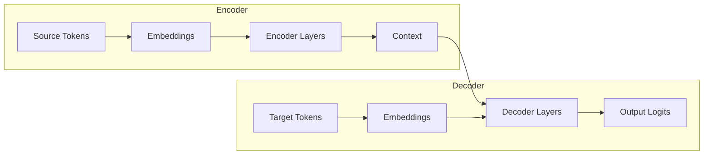
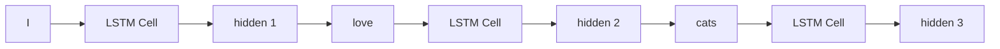
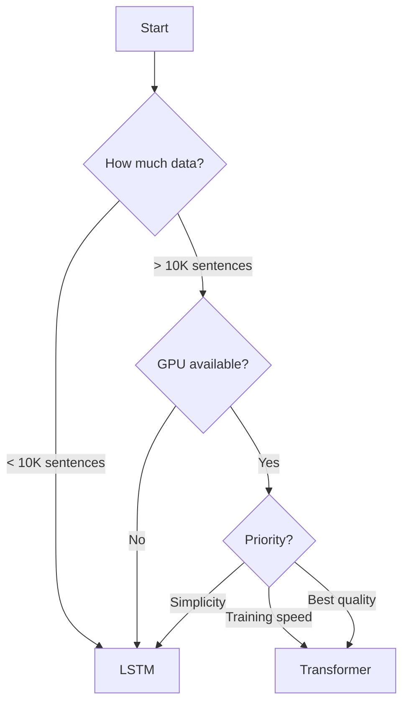

# Model Architectures

TorchLingo provides two sequence-to-sequence architectures: a classic **LSTM** model and a modern **Transformer**. This page explains how each works and when to use them.

## Which models are these, exactly?

Worth knowing before anything else, because it means the paper you were assigned describes the code you are running.

**`SimpleTransformer` is the Transformer of Vaswani et al. (2017)** — ["Attention Is All You Need"](https://arxiv.org/abs/1706.03762). Not a variant and not a cut-down teaching model: the same encoder–decoder shape, multi-head scaled dot-product attention, sinusoidal positional encoding, and embeddings scaled by √`d_model`. **"Simple" describes the implementation, not the architecture** — the code is written to be read, and the model it builds is the standard one. Every Marian, OpenNMT or Fairseq tutorial you find online is describing the same family.

`SimpleLSTM` is the earlier encoder–decoder family that the Transformer replaced — Sutskever et al. (2014), with optional Bahdanau-style attention on top.

### The two configurations you will meet

The library's defaults are **Transformer-base**, the paper's own configuration, exactly:

| | `d_model` | heads | layers | `d_ff` | parameters |
|---|---|---|---|---|---|
| **Library default** = Vaswani base | 512 | 8 | 6 + 6 | 2048 | 56,436,544 |
| **CS 479 / Assignment 8** | 256 | 8 | 3 + 3 | 1024 | 11,682,624 |

The course configuration is roughly half-scale in width and depth, which puts it at about a fifth of the parameters. That is not a compromise on principle — it is what fits comfortably in a Colab session alongside a corpus, and it trains in tens of minutes rather than hours.

**Both are the same architecture.** Nothing in the model code changes between them.

### Bigger is not simply better, and the numbers say so

This is the part worth carrying away, and it is measured rather than asserted — see [the benchmark report](https://github.com/byu-matrix-lab/torchlingo/blob/main/notes/reports/a8-benchmark.md) for the full sweep, which trained both configurations on seven corpus sizes under one fixed step budget.

| training pairs | 11.7M model | 56.4M model | difference |
|---|---|---|---|
| 25,000 | 9.55 | 9.24 | **−0.31** |
| 50,000 | 13.68 | 13.62 | **−0.06** |
| 100,000 | 15.95 | 17.79 | **+1.84** |
| 800,000 | 17.15 | 24.00 | **+6.85** |

BLEU, greedy decoding, German–English.

**Below about 50,000 pairs the larger model is not better.** It has more capacity than the data can teach, and both models converged, so neither was short of training. From 100,000 pairs upward the larger model pulls away and keeps pulling away.

So the honest answer to "which model should I use?" is *it depends on how much data you have*, and the two questions cannot be separated. The same 48× increase in corpus size is worth about **+1 BLEU** to a 1.8M-parameter model, **+7** at 11.7M, and **+15** at 56.4M.

## The Encoder-Decoder Framework

Both models follow the same high-level pattern:


```mermaid
flowchart LR
    subgraph Encoder
        A[Source Tokens] --> B[Embeddings]
        B --> C[Encoder Layers]
        C --> D[Context]
    end
    
    subgraph Decoder
        D --> E[Decoder Layers]
        F[Target Tokens] --> G[Embeddings]
        G --> E
        E --> H[Output Logits]
    end
```

The difference is in **how** the encoder and decoder process sequences.

## LSTM: The Classic Approach

### How LSTMs Work

**Long Short-Term Memory** networks process sequences one step at a time, maintaining a "hidden state" that accumulates information:

```
Step 1: Read "I"       → Update hidden state
Step 2: Read "love"    → Update hidden state  
Step 3: Read "cats"    → Update hidden state (now contains "I love cats")
```


```mermaid
flowchart LR
    A[I] --> B[LSTM Cell]
    B --> C[hidden 1]
    C --> D[love]
    D --> E[LSTM Cell]
    E --> F[hidden 2]
    F --> G[cats]
    G --> H[LSTM Cell]
    H --> I[hidden 3]
```

### TorchLingo's SimpleSeq2SeqLSTM

```python
from torchlingo.models import SimpleSeq2SeqLSTM

model = SimpleSeq2SeqLSTM(
    src_vocab_size=10000,
    tgt_vocab_size=10000,
    emb_dim=256,      # Embedding dimension
    hidden_dim=512,   # LSTM hidden size
    num_layers=2,     # Stacked LSTM layers
    dropout=0.1,
)
```

### LSTM Architecture Diagram

```
┌─────────────────────────────────────────┐
│                ENCODER                  │
│  ┌───────────────────────────────────┐  │
│  │         Embedding Layer           │  │
│  │   src_vocab_size → emb_dim        │  │
│  └───────────────────────────────────┘  │
│                   ↓                     │
│  ┌───────────────────────────────────┐  │
│  │         LSTM Layers × N           │  │
│  │   emb_dim → hidden_dim            │  │
│  └───────────────────────────────────┘  │
│                   ↓                     │
│         (hidden_state, cell_state)      │
└─────────────────────────────────────────┘
                    ↓
┌─────────────────────────────────────────┐
│                DECODER                  │
│  ┌───────────────────────────────────┐  │
│  │         Embedding Layer           │  │
│  └───────────────────────────────────┘  │
│                   ↓                     │
│  ┌───────────────────────────────────┐  │
│  │         LSTM Layers × N           │  │
│  │  (initialized with encoder state) │  │
│  └───────────────────────────────────┘  │
│                   ↓                     │
│  ┌───────────────────────────────────┐  │
│  │         Linear Output             │  │
│  │   hidden_dim → tgt_vocab_size     │  │
│  └───────────────────────────────────┘  │
└─────────────────────────────────────────┘
```

### Pros and Cons

| Pros | Cons |
| ---- | ---- |
| ✅ Simple to understand | ❌ Sequential (slow to train) |
| ✅ Few hyperparameters | ❌ Hard to capture long-range dependencies |
| ✅ Works on small datasets | ❌ Information bottleneck in hidden state |

## Transformer: The Modern Standard

### The Attention Revolution

Transformers process the **entire sequence at once** using attention:

```
Query: "What word should I focus on?"
Keys:  [I, love, cats] 
Values: [embed(I), embed(love), embed(cats)]

Attention weights: [0.1, 0.3, 0.6]  ← Focus mostly on "cats"
Output: weighted combination of values
```

### Self-Attention Explained

Self-attention lets each position look at all other positions:

```python
# Simplified attention computation
Q = input @ W_q  # Query projection
K = input @ W_k  # Key projection  
V = input @ W_v  # Value projection

attention_weights = softmax(Q @ K.T / sqrt(d_k))
output = attention_weights @ V
```

For "I love cats", the word "love" can directly attend to both "I" and "cats".

### Multi-Head Attention

Instead of one attention pattern, use multiple "heads" that learn different relationships:

```
Head 1: Subject-verb relationships
Head 2: Adjective-noun relationships
Head 3: Syntactic patterns
...
```

### TorchLingo's SimpleTransformer

```python
from torchlingo.models import SimpleTransformer

model = SimpleTransformer(
    src_vocab_size=10000,
    tgt_vocab_size=10000,
    d_model=512,           # Model dimension
    n_heads=8,             # Attention heads
    num_encoder_layers=6,  # Encoder depth
    num_decoder_layers=6,  # Decoder depth
    d_ff=2048,             # Feed-forward dimension
    dropout=0.1,
)
```

#### Post-norm by default, pre-norm on request

Where a layer puts its normalization is a real architectural choice, and TorchLingo exposes it:

```
x = LayerNorm(x + Sublayer(x))        # post-norm — the default, and the 2017 paper
x = x + Sublayer(LayerNorm(x))        # pre-norm  — norm_first=True
```

```python
paper = SimpleTransformer(src_vocab_size=10000, tgt_vocab_size=10000)
modern = SimpleTransformer(src_vocab_size=10000, tgt_vocab_size=10000, norm_first=True)
```

Both have **exactly the same parameters** — the same tensors in the same shapes, applied in a
different order. Only the arithmetic changes.

**The default is post-norm**, matching *Attention Is All You Need*, because that is the paper
this course teaches from. If you diagram a TorchLingo encoder block or trace its residual
stream, follow the paper.

**Pre-norm is what nearly everything published since 2017 uses.** It keeps a clean residual path
from input to output, which makes gradients better behaved in deep stacks; in practice it trains
more stably and usually needs no learning-rate warmup. If you are comparing TorchLingo against a
modern reference implementation and the training curves disagree, this is one of the first
differences to check — and now you can just switch it rather than read about it.

At the three-layer depth this course uses, the stability difference that motivated pre-norm
barely arises, so the default costs you nothing. It matters at twelve layers and more.

Either way it is selectable through the config too, so a sweep need not touch the call site:

```python
from torchlingo.config import Config

model = SimpleTransformer(
    src_vocab_size=10000, tgt_vocab_size=10000, config=Config(norm_first=True)
)
```

### Transformer Architecture Diagram

```
┌───────────────────────────────────────────────┐
│                   ENCODER                     │
│  ┌─────────────────────────────────────────┐  │
│  │   Token Embedding + Positional Encoding │  │
│  └─────────────────────────────────────────┘  │
│                      ↓                        │
│  ┌─────────────────────────────────────────┐  │
│  │         Encoder Layer × N               │  │
│  │  ┌───────────────────────────────────┐  │  │
│  │  │     Multi-Head Self-Attention     │  │  │
│  │  └───────────────────────────────────┘  │  │
│  │  ┌───────────────────────────────────┐  │  │
│  │  │        Feed-Forward Network       │  │  │
│  │  └───────────────────────────────────┘  │  │
│  └─────────────────────────────────────────┘  │
└───────────────────────────────────────────────┘
                       ↓
              Encoder Output (Memory)
                       ↓
┌───────────────────────────────────────────────┐
│                   DECODER                     │
│  ┌─────────────────────────────────────────┐  │
│  │   Token Embedding + Positional Encoding │  │
│  └─────────────────────────────────────────┘  │
│                      ↓                        │
│  ┌─────────────────────────────────────────┐  │
│  │         Decoder Layer × N               │  │
│  │  ┌───────────────────────────────────┐  │  │
│  │  │  Masked Multi-Head Self-Attention │  │  │
│  │  └───────────────────────────────────┘  │  │
│  │  ┌───────────────────────────────────┐  │  │
│  │  │   Cross-Attention (to encoder)    │  │  │
│  │  └───────────────────────────────────┘  │  │
│  │  ┌───────────────────────────────────┐  │  │
│  │  │        Feed-Forward Network       │  │  │
│  │  └───────────────────────────────────┘  │  │
│  └─────────────────────────────────────────┘  │
│                      ↓                        │
│  ┌─────────────────────────────────────────┐  │
│  │        Linear → tgt_vocab_size          │  │
│  └─────────────────────────────────────────┘  │
└───────────────────────────────────────────────┘
```

### Positional Encoding

Since attention processes all positions simultaneously, the model has no sense of order. **Positional encodings** add position information:

TorchLingo uses the **sinusoidal positional encoding** from the original Transformer paper, added to the token embeddings:

```python
from torchlingo.models.positional import SinusoidalPositionalEncoding

pos_enc = SinusoidalPositionalEncoding(d_model=512, max_seq_len=2048)
```

Sinusoidal encoding advantages:

- No learned parameters — produces valid values for any position
- For a fixed offset, encodings are related by a simple rotation, so the model can learn to attend by relative position
- It is what the original Transformer used, so this implementation matches the paper here too

### Masking

Two types of masks in Transformers:

**Padding Mask**: Ignore PAD tokens

```
Sequence: [Hello, World, PAD, PAD]
Mask:     [False, False, True, True]  ← Don't attend to PAD
```

**Causal Mask**: Decoder can't see future tokens

```
Position 0: Can see [0]
Position 1: Can see [0, 1]
Position 2: Can see [0, 1, 2]
Position 3: Can see [0, 1, 2, 3]
```

### Pros and Cons

| Pros | Cons |
| ---- | ---- |
| ✅ Parallel training (fast) | ❌ More hyperparameters |
| ✅ Captures long-range dependencies | ❌ Quadratic memory in sequence length |
| ✅ State-of-the-art quality | ❌ Needs more data |

## Choosing a Model

### Decision Guide


```mermaid
flowchart TD
    A[Start] --> B{How much data?}
    B -->|< 10K sentences| C[LSTM]
    B -->|> 10K sentences| D{GPU available?}
    D -->|No| C
    D -->|Yes| E{Priority?}
    E -->|Training speed| F[Transformer]
    E -->|Simplicity| C
    E -->|Best quality| F
```

### Quick Comparison

| Aspect | LSTM | Transformer |
| ------ | ---- | ----------- |
| **Parameters** | ~5-20M | ~20-100M |
| **Training speed** | Slow | Fast (parallel) |
| **Inference speed** | Fast | Medium |
| **Memory usage** | O(n) | O(n²) |
| **Long sequences** | Struggles | Handles well |
| **Minimum data** | ~5K pairs | ~50K pairs (measured — see below) |

The Transformer figure is now backed by a measurement rather than folklore: at 25,000 pairs the
course model reaches 9.55 BLEU, at 50,000 it reaches 13.68, and 50,000 is also the point below
which extra model capacity stops helping at all. So "about 50,000" is where a Transformer starts
repaying itself on this language pair.

### Configuration Examples

The first two are illustrative. The third is the library default and, as noted above, Vaswani
base exactly.

#### Tiny Model (Demo/Testing)

```python
config = Config(
    # Transformer
    d_model=128,
    n_heads=4,
    num_encoder_layers=2,
    num_decoder_layers=2,
    d_ff=512,
)
# ~1M parameters, trains in seconds
```

A model this small is for checking that your pipeline runs, not for translating. Measured at
`d_model=64`: **48× more data moves BLEU by one point**, because the capacity, not the corpus,
is the limit.

#### Course Model (CS 479, Assignment 8)

```python
config = Config(
    d_model=256,
    n_heads=8,
    num_encoder_layers=3,
    num_decoder_layers=3,
    d_ff=1024,
)
# 11,682,624 parameters; about 40 minutes on an A100 for 100,000 pairs
```

This is what Assignment 8 trains, and what the numbers in the benchmark report are for unless
they say otherwise. It fits a Colab session.

#### Transformer-base (the library default)

```python
config = Config(
    d_model=512,
    n_heads=8,
    num_encoder_layers=6,
    num_decoder_layers=6,
    d_ff=2048,
)
# 56,436,544 parameters; about 2 hours on an A100 for 800,000 pairs
```

Worth it once you have **100,000 pairs or more** — below that it buys nothing. Whether it fits a
free Colab session has not been measured.

## Model Methods

### Common Interface

Both models share a similar interface:

```python
# Forward pass (training)
logits = model(src_batch, tgt_batch)

# Encode only (for inference)
memory = model.encode(src_batch)

# Decode step (for inference)  
output = model.decode(tgt_batch, memory)
```

### Saving and Loading

```python
import torch

# Save
torch.save(model.state_dict(), "model.pt")

# Load
model.load_state_dict(torch.load("model.pt"))
```

## Under the Hood

### Embedding Scaling

TorchLingo scales embeddings by √d_model to prevent values from getting too small:

```python
# In SimpleTransformer
src_emb = self.src_tok_emb(src) * math.sqrt(self.d_model)
```

### Weight Initialization

Xavier/Glorot initialization for stable training:

```python
for m in self.modules():
    if isinstance(m, nn.Linear):
        nn.init.xavier_uniform_(m.weight)
```

## Next Steps

Now that you understand the models, learn how to train them:

[Training Loop :material-arrow-right:](training.md){ .md-button .md-button--primary }
