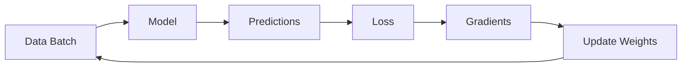

# Training Loop

This page explains how to train NMT models effectively, from basic training loops to advanced techniques.

## The Training Process

Training teaches the model to predict target words given source sentences. Each training step:

1. **Forward pass**: Feed data through model, get predictions
2. **Compute loss**: Measure how wrong the predictions are
3. **Backward pass**: Compute gradients (direction to improve)
4. **Update weights**: Adjust model parameters



## Basic Training Loop

### Minimal Example

```python
import torch
from torch.utils.data import DataLoader
from torchlingo.data_processing import NMTDataset, collate_fn
from torchlingo.models import SimpleTransformer
from torchlingo.config import Config

# Setup
config = Config(batch_size=32, learning_rate=1e-4)
dataset = NMTDataset("data/train.tsv")
loader = DataLoader(dataset, batch_size=config.batch_size, 
                    shuffle=True, collate_fn=collate_fn)

model = SimpleTransformer(
    src_vocab_size=len(dataset.src_vocab),
    tgt_vocab_size=len(dataset.tgt_vocab),
    config=config,
)

# Loss and optimizer
criterion = torch.nn.CrossEntropyLoss(ignore_index=config.pad_idx)
optimizer = torch.optim.Adam(model.parameters(), lr=config.learning_rate)

# Training loop
model.train()
for epoch in range(10):
    total_loss = 0
    for src, tgt in loader:
        # Teacher forcing setup
        tgt_input = tgt[:, :-1]
        tgt_output = tgt[:, 1:]
        
        # Forward
        logits = model(src, tgt_input)
        loss = criterion(logits.reshape(-1, logits.size(-1)), 
                        tgt_output.reshape(-1))
        
        # Backward
        optimizer.zero_grad()
        loss.backward()
        optimizer.step()
        
        total_loss += loss.item()
    
    print(f"Epoch {epoch+1}: Loss = {total_loss/len(loader):.4f}")
```

## Understanding Teacher Forcing

During training, we feed the **correct** previous tokens to the decoder, not its own predictions:

```text
Source: "I love cats"
Target: "<sos> Me gustan los gatos <eos>"

Decoder Input:  [<sos>, Me, gustan, los, gatos]  ← Correct tokens
Decoder Output: [Me, gustan, los, gatos, <eos>]  ← What we predict
```

### Why Teacher Forcing?

| Without Teacher Forcing | With Teacher Forcing |
| ----------------------- | -------------------- |
| Model sees its own mistakes | Model sees correct tokens |
| Errors compound | Stable learning signal |
| Slow to converge | Fast convergence |

!!! warning "Exposure Bias"
    Teacher forcing creates a train-test mismatch: at test time, the model sees its own predictions (possibly wrong). This is called **exposure bias**.

## Loss Function

### Cross-Entropy Loss

We use cross-entropy loss, which measures how different the predicted distribution is from the true distribution:

$$
\mathcal{L} = -\sum_{t=1}^{T} \log P(y_t | y_{<t}, x)
$$

```python
criterion = torch.nn.CrossEntropyLoss(ignore_index=config.pad_idx)
```

The `ignore_index` parameter tells the loss function to skip PAD tokens—we don't want to penalize predictions at padding positions.

### Label Smoothing

A regularization technique that prevents overconfident predictions:

```python
criterion = torch.nn.CrossEntropyLoss(
    ignore_index=config.pad_idx,
    label_smoothing=0.1,  # Smooth by 10%
)
```

Instead of targeting 100% probability on the correct word, we target 90% correct + 10% spread across all words.

## Optimizers

### Adam (Recommended)

Adam adapts learning rates per-parameter and works well out of the box:

```python
optimizer = torch.optim.Adam(
    model.parameters(),
    lr=1e-4,           # Learning rate
    betas=(0.9, 0.98), # Momentum terms
    eps=1e-9,          # Numerical stability
)
```

### AdamW (With Weight Decay)

Decoupled weight decay helps prevent overfitting:

```python
optimizer = torch.optim.AdamW(
    model.parameters(),
    lr=1e-4,
    weight_decay=0.01,
)
```

## Learning Rate Scheduling

### Why Schedule?

- **Start low**: Model weights are random, large updates can destabilize
- **Increase**: Let the model learn quickly during main training
- **Decrease**: Fine-tune with smaller steps at the end

### Warmup + Decay Schedule

The classic Transformer schedule:

```python
def transformer_lr_schedule(step, d_model, warmup_steps=4000):
    """Noam learning rate schedule from 'Attention Is All You Need'."""
    step = max(step, 1)  # Avoid division by zero
    return d_model**(-0.5) * min(step**(-0.5), step * warmup_steps**(-1.5))

# Usage with LambdaLR
scheduler = torch.optim.lr_scheduler.LambdaLR(
    optimizer,
    lr_lambda=lambda step: transformer_lr_schedule(step, d_model=512),
)

# In training loop
for batch in loader:
    # ... training code ...
    scheduler.step()
```

### Simpler Alternatives

```python
# Step decay: halve LR every 5 epochs
scheduler = torch.optim.lr_scheduler.StepLR(optimizer, step_size=5, gamma=0.5)

# Reduce on plateau: halve LR when loss stops improving
scheduler = torch.optim.lr_scheduler.ReduceLROnPlateau(
    optimizer, mode='min', factor=0.5, patience=2
)
```

### Config-Based Scheduling with `train_model()`

When using TorchLingo's `train_model()`, scheduler selection is handled automatically via the `scheduler_type` config parameter — no manual setup needed:

```python
from torchlingo.config import Config
from torchlingo.training import train_model

config = Config(
    learning_rate=1e-4,
    scheduler_type="plateau",   # "cosine" | "plateau" | "transformer" | "noam" | "none"
    scheduler_patience=3,       # plateau only: validations before LR is halved
    warmup_steps=8000,          # cosine/transformer/noam: steps for linear warmup
)

result = train_model(model, train_loader, val_loader, config=config)
```

| `scheduler_type` | Behaviour |
| ---------------- | --------- |
| `"cosine"` (default) | Linear warmup then cosine decay — good general choice |
| `"plateau"` | Halves LR after `scheduler_patience` validations with no improvement |
| `"transformer"` / `"noam"` | Inverse square-root decay (Vaswani et al. 2017) |
| `"none"` | Constant learning rate throughout training |

## Gradient Clipping

Prevent exploding gradients by capping their magnitude:

```python
torch.nn.utils.clip_grad_norm_(model.parameters(), max_norm=1.0)
```

Add this **after** `loss.backward()` but **before** `optimizer.step()`.

## Validation

Always monitor performance on held-out data:

```python
def validate(model, val_loader, criterion):
    model.eval()
    total_loss = 0
    with torch.no_grad():
        for src, tgt in val_loader:
            tgt_input = tgt[:, :-1]
            tgt_output = tgt[:, 1:]
            logits = model(src, tgt_input)
            loss = criterion(logits.reshape(-1, logits.size(-1)),
                           tgt_output.reshape(-1))
            total_loss += loss.item()
    return total_loss / len(val_loader)
```

### Early Stopping

Stop training when validation performance stops improving:

```python
best_val_loss = float('inf')
patience = 3
patience_counter = 0

for epoch in range(100):
    train(...)
    val_loss = validate(model, val_loader, criterion)
    
    if val_loss < best_val_loss:
        best_val_loss = val_loss
        patience_counter = 0
        # Save best model
        torch.save(model.state_dict(), "best_model.pt")
    else:
        patience_counter += 1
        if patience_counter >= patience:
            print("Early stopping!")
            break
```

## Checkpointing

Save your progress to resume later:

```python
def save_checkpoint(model, optimizer, scheduler, epoch, loss, path):
    torch.save({
        'epoch': epoch,
        'model_state_dict': model.state_dict(),
        'optimizer_state_dict': optimizer.state_dict(),
        'scheduler_state_dict': scheduler.state_dict(),
        'loss': loss,
    }, path)

def load_checkpoint(model, optimizer, scheduler, path):
    checkpoint = torch.load(path)
    model.load_state_dict(checkpoint['model_state_dict'])
    optimizer.load_state_dict(checkpoint['optimizer_state_dict'])
    scheduler.load_state_dict(checkpoint['scheduler_state_dict'])
    return checkpoint['epoch'], checkpoint['loss']
```

## GPU Training

Move model and data to GPU for faster training:

```python
device = torch.device("cuda" if torch.cuda.is_available() else "cpu")
model = model.to(device)

for src, tgt in loader:
    src = src.to(device)
    tgt = tgt.to(device)
    # ... training code ...
```

!!! tip "Apple Silicon"
    On M1/M2/M3 Macs, use MPS:
    ```python
    device = torch.device("mps" if torch.backends.mps.is_available() else "cpu")
    ```

## Mixed Precision Training

Use FP16 for faster training with less memory:

```python
from torch.cuda.amp import autocast, GradScaler

scaler = GradScaler()

for src, tgt in loader:
    optimizer.zero_grad()
    
    with autocast():  # FP16 forward pass
        logits = model(src, tgt_input)
        loss = criterion(logits.reshape(-1, logits.size(-1)),
                        tgt_output.reshape(-1))
    
    scaler.scale(loss).backward()  # FP16 backward
    scaler.step(optimizer)
    scaler.update()
```

## Logging with TensorBoard

TorchLingo's `train_model()` function automatically logs metrics to TensorBoard when enabled in the config. Simply set `use_tensorboard=True`:

```python
from torchlingo.config import Config
from torchlingo.training import train_model

config = Config(
    use_tensorboard=True,
    experiment_name="my_experiment",
    tensorboard_dir="./runs",
    log_interval=100,  # Log every 100 steps
)

result = train_model(
    model=model,
    train_loader=train_loader,
    val_loader=val_loader,
    config=config,
)
```

TensorBoard will automatically track:
- **train/loss**: Training loss at each log interval
- **train/epoch_loss**: Average training loss per epoch
- **train/learning_rate**: Learning rate from optimizer
- **val/loss**: Validation loss at each validation interval
- **val/epoch_loss**: Average validation loss per epoch

View the dashboard with:
```bash
tensorboard --logdir runs
```

If you need custom logging beyond what's provided, you can disable automatic logging and use `SummaryWriter` directly:

```python
config = Config(use_tensorboard=False)

from torch.utils.tensorboard import SummaryWriter
writer = SummaryWriter("runs/custom_experiment")

# Your custom logging here
writer.add_scalar("custom_metric", value, step)
writer.close()
```

## Complete Training Script

```python
import torch
from torch.utils.data import DataLoader
from torch.utils.tensorboard import SummaryWriter
from torchlingo.data_processing import NMTDataset, collate_fn
from torchlingo.models import SimpleTransformer
from torchlingo.config import Config

def train_epoch(model, loader, criterion, optimizer, device, grad_clip=1.0):
    model.train()
    total_loss = 0
    for src, tgt in loader:
        src, tgt = src.to(device), tgt.to(device)
        tgt_input, tgt_output = tgt[:, :-1], tgt[:, 1:]
        
        optimizer.zero_grad()
        logits = model(src, tgt_input)
        loss = criterion(logits.reshape(-1, logits.size(-1)),
                        tgt_output.reshape(-1))
        loss.backward()
        torch.nn.utils.clip_grad_norm_(model.parameters(), grad_clip)
        optimizer.step()
        
        total_loss += loss.item()
    return total_loss / len(loader)

def validate(model, loader, criterion, device):
    model.eval()
    total_loss = 0
    with torch.no_grad():
        for src, tgt in loader:
            src, tgt = src.to(device), tgt.to(device)
            tgt_input, tgt_output = tgt[:, :-1], tgt[:, 1:]
            logits = model(src, tgt_input)
            loss = criterion(logits.reshape(-1, logits.size(-1)),
                           tgt_output.reshape(-1))
            total_loss += loss.item()
    return total_loss / len(loader)

def main():
    # Config
    config = Config(
        batch_size=32,
        learning_rate=1e-4,
        d_model=256,
        n_heads=8,
        num_encoder_layers=4,
        num_decoder_layers=4,
    )
    device = torch.device("cuda" if torch.cuda.is_available() else "cpu")
    
    # Data
    train_data = NMTDataset("data/train.tsv", config=config)
    val_data = NMTDataset("data/val.tsv", 
                          src_vocab=train_data.src_vocab,
                          tgt_vocab=train_data.tgt_vocab,
                          config=config)
    
    train_loader = DataLoader(train_data, config.batch_size, shuffle=True, 
                              collate_fn=collate_fn)
    val_loader = DataLoader(val_data, config.batch_size, collate_fn=collate_fn)
    
    # Model
    model = SimpleTransformer(
        len(train_data.src_vocab),
        len(train_data.tgt_vocab),
        config=config,
    ).to(device)
    
    criterion = torch.nn.CrossEntropyLoss(ignore_index=config.pad_idx)
    optimizer = torch.optim.AdamW(model.parameters(), lr=config.learning_rate)
    scheduler = torch.optim.lr_scheduler.ReduceLROnPlateau(
        optimizer, mode='min', factor=0.5, patience=2
    )
    
    # Training
    writer = SummaryWriter()
    best_val_loss = float('inf')
    
    for epoch in range(50):
        train_loss = train_epoch(model, train_loader, criterion, 
                                 optimizer, device)
        val_loss = validate(model, val_loader, criterion, device)
        scheduler.step(val_loss)
        
        writer.add_scalars("Loss", {"train": train_loss, "val": val_loss}, epoch)
        print(f"Epoch {epoch+1}: Train={train_loss:.4f}, Val={val_loss:.4f}")
        
        if val_loss < best_val_loss:
            best_val_loss = val_loss
            torch.save(model.state_dict(), "best_model.pt")

if __name__ == "__main__":
    main()
```

## Hyperparameter Guide

| Parameter | Typical Range | Notes |
| --------- | ------------- | ----- |
| Learning rate | 1e-5 to 1e-3 | Lower for fine-tuning |
| Batch size | 16-128 | Larger = faster but more memory |
| Warmup steps | 1K-10K | More for larger models |
| Dropout | 0.1-0.3 | Higher for less data |
| Label smoothing | 0.0-0.1 | 0.1 is common |
| Gradient clip | 0.5-5.0 | 1.0 is usually safe |

## Next Steps

Now learn how to generate translations from trained models:

[Tutorials :material-arrow-right:](../tutorials/index.md){ .md-button .md-button--primary }
