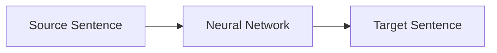
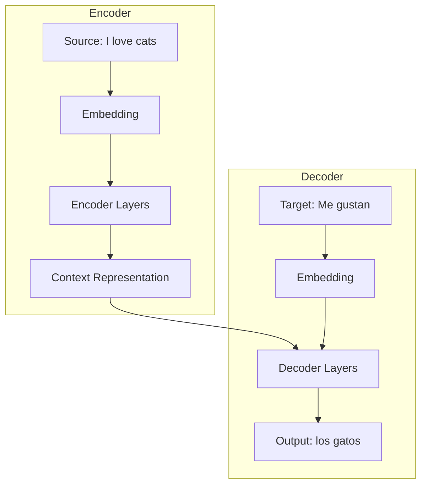

# What is Neural Machine Translation?

Welcome to the world of **Neural Machine Translation (NMT)**! This page explains the core concepts you'll need to understand before diving into the code.

## The Goal

Given a sentence in one language (the **source**), produce a sentence in another language (the **target**) that means the same thing:

```
Input:  "The quick brown fox jumps over the lazy dog."
Output: "El rápido zorro marrón salta sobre el perro perezoso."
```

Simple concept, challenging execution!

## A Brief History

### Before Neural Networks (1950s-2010s)

Early machine translation used **rule-based systems**—linguists wrote thousands of grammar rules by hand. Later, **Statistical Machine Translation (SMT)** learned patterns from data:

```
P(target | source) = P(source | target) × P(target) / P(source)
```

SMT worked, but required many separately-trained components (alignment models, language models, reordering models).

### The Neural Revolution (2014-present)

**Neural Machine Translation** uses a single neural network trained end-to-end:



Key breakthrough: [Sutskever et al. (2014)](https://arxiv.org/abs/1409.3215) showed that sequence-to-sequence models could match SMT. Then [Vaswani et al. (2017)](https://arxiv.org/abs/1706.03762) introduced the **Transformer**, which powers nearly all modern translation systems.

## The Encoder-Decoder Architecture

All NMT systems share this basic structure:



### The Encoder

The encoder reads the **entire** source sentence and creates a rich representation that captures:

- The meaning of each word
- How words relate to each other
- Overall sentence structure

This representation is often called the **context** or **memory**.

### The Decoder

The decoder generates the target sentence **one word at a time**, using:

1. The encoder's context representation
2. The words it has generated so far

It's like writing a translation while constantly referring back to the original text.

## Key Concepts

### Embeddings

Neural networks work with numbers, not words. **Embeddings** convert words to vectors (lists of numbers):

```python
# "cat" might become:
embedding["cat"] = [0.2, -0.5, 0.8, 0.1, ...]  # 512 numbers
```

Similar words have similar embeddings. The model learns these during training!

### Attention Mechanism

The decoder needs to focus on different parts of the source sentence when generating each target word:

| Generating      | Should focus on |
| --------------- | --------------- |
| "gato" (cat)    | "cat"           |
| "negro" (black) | "black"         |
| "duerme" (sleeps) | "sleeps"      |

**Attention** computes a weighted average of encoder outputs, where weights indicate "how much to focus on each source word."

```python
# Simplified attention
weights = softmax(query @ keys.T)  # Which words to focus on
context = weights @ values         # Weighted combination
```

!!! tip "Why 'Attention'?"
    The name comes from how humans translate: we pay **attention** to specific words in the source while writing each word of the translation.

### The Transformer

The Transformer architecture (used in TorchLingo's `SimpleTransformer`) stacks multiple attention layers:

```
┌─────────────────────────────────┐
│         Encoder Stack           │
│  ┌───────────────────────────┐  │
│  │   Self-Attention Layer    │  │ × 6 layers
│  │   Feed-Forward Layer      │  │
│  └───────────────────────────┘  │
└─────────────────────────────────┘
              ↓
┌─────────────────────────────────┐
│         Decoder Stack           │
│  ┌───────────────────────────┐  │
│  │   Masked Self-Attention   │  │
│  │   Cross-Attention         │  │ × 6 layers
│  │   Feed-Forward Layer      │  │
│  └───────────────────────────┘  │
└─────────────────────────────────┘
```

Key innovations:

- **Parallelization**: Unlike RNNs, all positions are processed simultaneously
- **Long-range dependencies**: Attention connects distant words directly
- **Positional encoding**: Since there's no sequential processing, position information is added explicitly

## Training NMT

### The Data

You need **parallel corpora**: aligned sentences in both languages.

| Source (English)   | Target (Spanish)   |
| ------------------ | ------------------ |
| Hello world        | Hola mundo         |
| I like pizza       | Me gusta la pizza  |
| ...                | ...                |

More data = better translations. Production systems train on billions of sentences!

### The Objective

During training, we maximize the probability of generating the correct translation:

$$
\mathcal{L} = -\sum_{t=1}^{T} \log P(y_t | y_{<t}, \mathbf{x})
$$

In plain English: "Make the model assign high probability to each correct target word, given the source and previous target words."

### Teacher Forcing

A training trick: instead of feeding the model its own predictions, we feed the **correct** previous word. This provides a stable learning signal.

```python
# Teacher forcing
input:  [<sos>, "Me", "gustan", "los"]
target: ["Me", "gustan", "los", "gatos", <eos>]
```

## Inference (Generating Translations)

At test time, we don't have the target sentence! We generate it:

### Greedy Decoding

Pick the most likely word at each step:

```
Step 1: P("Hola"|source) = 0.8, P("El"|source) = 0.1, ... → "Hola"
Step 2: P("mundo"|"Hola") = 0.7, ... → "mundo"
Step 3: P("<eos>"|"Hola mundo") = 0.9 → STOP
```

Fast but can miss better translations.

### Beam Search

Keep track of multiple hypotheses (beams) and pick the best complete sentence:

```
Beam 1: "Hola mundo" (score: -2.3)
Beam 2: "Hola a todos" (score: -2.8)
Beam 3: "Buenos días" (score: -3.1)
→ Pick Beam 1
```

Slower but often produces better translations.

## Evaluation: How Good is My Translation?

### BLEU Score

**BLEU** (Bilingual Evaluation Understudy) measures n-gram overlap between your translation and reference translations:

```python
from sacrebleu import sentence_bleu

reference = "El rápido zorro marrón"
hypothesis = "El rápido zorro café"

score = sentence_bleu(hypothesis, [reference])
print(f"BLEU: {score.score:.1f}")  # BLEU: 45.3
```

| BLEU Score | Quality              |
| ---------- | -------------------- |
| < 10       | Almost unusable      |
| 10-20      | Gist is clear        |
| 20-30      | Understandable       |
| 30-40      | Good quality         |
| 40-50      | High quality         |
| > 50       | Very high quality    |

!!! warning "BLEU Limitations"
    BLEU doesn't capture meaning—it just counts matching words. "The cat sat" vs "The feline reclined" would score low despite similar meaning.

## TorchLingo's Place

TorchLingo implements these concepts in a beginner-friendly way:

| Concept              | TorchLingo Component                    |
| -------------------- | --------------------------------------- |
| Embeddings           | `nn.Embedding` in models                |
| Encoder-Decoder      | `SimpleTransformer`, `SimpleSeq2SeqLSTM` |
| Attention            | Built into Transformer layers           |
| Vocabulary           | `SimpleVocab`, `SentencePieceVocab`     |
| Data loading         | `NMTDataset`, `create_dataloaders`      |
| Training utilities   | Config-driven training loops            |

## Further Reading

- 📄 [Attention Is All You Need](https://arxiv.org/abs/1706.03762) - The Transformer paper
- 📄 [Sequence to Sequence Learning](https://arxiv.org/abs/1409.3215) - The original Seq2Seq paper
- 📖 [The Illustrated Transformer](https://jalammar.github.io/illustrated-transformer/) - Visual explanation
- 📖 [Neural Machine Translation and Sequence-to-sequence Models](https://arxiv.org/abs/1703.01619) - Comprehensive tutorial

## Next Steps

Now that you understand the theory, let's see how TorchLingo implements it:

[Data Pipeline :material-arrow-right:](data-pipeline.md){ .md-button .md-button--primary }
