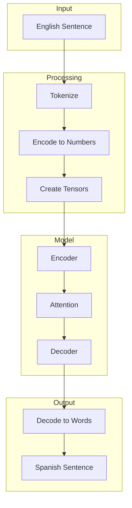

# Your First Translation

In this guide, we'll build a complete English→Spanish translation pipeline from scratch. By the end, you'll understand every component of a neural machine translation system.

<!-- [](https://colab.research.google.com/github/commanderjcc/torchlingo/blob/main/docs/docs/tutorials/02-train-tiny-model.ipynb) -->

## Prerequisites

- Basic Python knowledge
- 10-15 minutes of your time
- A Google account (for Colab) OR [TorchLingo installed locally](installation.md)

!!! note "PyTorch Experience Not Required"
    We'll explain every PyTorch concept as we encounter it. No prior deep learning experience needed!

## Quick Setup (Google Colab)

The easiest way to follow this tutorial is in Google Colab:

1. Click the "Open in Colab" badge above
2. Go to **Runtime → Change runtime type → GPU** (for faster training)
3. Run this setup cell:

```python
# Install TorchLingo
%pip install torchlingo

# Verify GPU is available
import torch
print(f"PyTorch version: {torch.__version__}")
print(f"CUDA available: {torch.cuda.is_available()}")
if torch.cuda.is_available():
    print(f"GPU: {torch.cuda.get_device_name(0)}")
```

## Overview

Here's what we'll build:



## Part 1: Understanding the Data

### What is Parallel Data?

Machine translation needs **parallel corpora**—the same sentences in both languages, aligned line by line:

| English (source)       | Spanish (target)      |
| ---------------------- | --------------------- |
| Hello!                 | ¡Hola!                |
| How are you?           | ¿Cómo estás?          |
| The cat sleeps.        | El gato duerme.       |

### Loading Data with TorchLingo

```python
import pandas as pd
from pathlib import Path
from torchlingo.preprocessing import load_data

# Load a TSV file
data_path = Path("data/demo_small/train.tsv")
df = load_data(data_path)

print(df.head())
```

Output:
```
                     src                   tgt
0            Hello world         Hola mundo
1    How are you today?   ¿Cómo estás hoy?
2          Good morning!      ¡Buenos días!
```

## Part 2: Building a Vocabulary

### Why Do We Need Vocabularies?

Neural networks work with numbers, not text. We need to:

1. **Tokenize**: Split sentences into words/subwords
2. **Index**: Assign each unique token a number
3. **Special tokens**: Add markers for start, end, unknown words, and padding

### The SimpleVocab Class

```python
from torchlingo.data_processing import SimpleVocab

# Create a vocabulary
vocab = SimpleVocab()

# Build from sentences
sentences = ["Hello world", "How are you", "Hello friend"]
vocab.build_vocab(sentences)

print(f"Vocabulary size: {len(vocab)}")
print(f"Token to index: {vocab.token2idx}")
```

Output:
```
Vocabulary size: 8
Token to index: {'<pad>': 0, '<unk>': 1, '<sos>': 2, '<eos>': 3, 'Hello': 4, 'world': 5, 'How': 6, 'are': 7, 'you': 8, 'friend': 9}
```

### Special Tokens Explained

| Token   | Index | Purpose                                      |
| ------- | ----- | -------------------------------------------- |
| `<pad>` | 0     | Fills shorter sequences to match batch size  |
| `<unk>` | 1     | Represents words not in vocabulary           |
| `<sos>` | 2     | "Start of sequence" - tells decoder to begin |
| `<eos>` | 3     | "End of sequence" - tells decoder to stop    |

### Encoding and Decoding

```python
# Encode: text → numbers
sentence = "Hello world"
indices = vocab.encode(sentence, add_special_tokens=True)
print(f"'{sentence}' → {indices}")  
# Output: 'Hello world' → [2, 4, 5, 3]  (SOS, Hello, world, EOS)

# Decode: numbers → text
decoded = vocab.decode(indices, skip_special_tokens=True)
print(f"{indices} → '{decoded}'")
# Output: [2, 4, 5, 3] → 'Hello world'
```

## Part 3: Creating a Dataset

The `NMTDataset` class combines everything:

```python
from torchlingo.data_processing import NMTDataset

# Create dataset (builds vocabularies automatically)
dataset = NMTDataset("data/demo_small/train.tsv")

# Access a sample
src_tensor, tgt_tensor = dataset[0]
print(f"Source tensor shape: {src_tensor.shape}")
print(f"Target tensor shape: {tgt_tensor.shape}")
print(f"Source indices: {src_tensor.tolist()}")
print(f"Target indices: {tgt_tensor.tolist()}")
```

!!! info "What's a Tensor?"
    A **tensor** is PyTorch's multi-dimensional array. Think of it as a NumPy array that can run on GPUs. A 1D tensor is like a list of numbers.

## Part 4: Understanding the Model

### The Encoder-Decoder Architecture

Translation models have two main parts:

1. **Encoder**: Reads the source sentence and creates a "representation" (a tensor that captures meaning)
2. **Decoder**: Uses that representation to generate the target sentence, one word at a time

```python
from torchlingo.models import SimpleTransformer

model = SimpleTransformer(
    src_vocab_size=len(dataset.src_vocab),
    tgt_vocab_size=len(dataset.tgt_vocab),
    d_model=128,       # Size of internal representations
    n_heads=4,         # Number of attention heads
    num_encoder_layers=2,
    num_decoder_layers=2,
)
```

### What is Attention?

Attention lets the decoder "look back" at different parts of the source sentence when generating each target word.

For example, when translating "The black cat" → "El gato negro":

- When generating "gato", the model pays attention to "cat"
- When generating "negro", the model pays attention to "black"

This is why Transformers work so well—they can learn these word alignments automatically!

## Part 5: The Training Loop

Training teaches the model by showing it examples and correcting its mistakes.

### Teacher Forcing

During training, we use **teacher forcing**: we give the decoder the correct previous word, even if it predicted wrong. This speeds up learning.

```python
import torch
from torch.utils.data import DataLoader
from torchlingo.data_processing import collate_fn

# Create batches
train_loader = DataLoader(
    dataset, 
    batch_size=16, 
    shuffle=True,
    collate_fn=collate_fn,
)

# Loss function (measures how wrong we are)
criterion = torch.nn.CrossEntropyLoss(ignore_index=0)  # Ignore padding

# Optimizer (updates model weights)
optimizer = torch.optim.Adam(model.parameters(), lr=0.001)

# Training loop
model.train()
for epoch in range(5):
    epoch_loss = 0
    for src_batch, tgt_batch in train_loader:
        # Teacher forcing setup
        tgt_input = tgt_batch[:, :-1]   # Everything except last token
        tgt_output = tgt_batch[:, 1:]   # Everything except first token
        
        # Forward pass
        logits = model(src_batch, tgt_input)
        
        # Compute loss
        loss = criterion(
            logits.reshape(-1, logits.size(-1)),
            tgt_output.reshape(-1)
        )
        
        # Backward pass (compute gradients)
        optimizer.zero_grad()
        loss.backward()
        optimizer.step()
        
        epoch_loss += loss.item()
    
    avg_loss = epoch_loss / len(train_loader)
    print(f"Epoch {epoch + 1}/5 - Loss: {avg_loss:.4f}")
```

### What's Happening Here?

1. **`tgt_input`**: We feed the decoder "[SOS] The cat" 
2. **`tgt_output`**: We expect it to predict "The cat [EOS]"
3. **Loss**: Measures difference between predicted and actual words
4. **Backward**: Computes how to adjust weights to reduce loss
5. **Optimizer step**: Actually adjusts the weights

## Part 6: Generating Translations

Once trained, we can translate new sentences:

```python
def translate(model, sentence, src_vocab, tgt_vocab, max_len=50):
    """Translate a single sentence using greedy decoding."""
    model.eval()  # Switch to evaluation mode
    
    # Encode source
    src_indices = src_vocab.encode(sentence, add_special_tokens=True)
    src_tensor = torch.tensor([src_indices])
    
    # Encode with model
    with torch.no_grad():  # Don't compute gradients
        memory = model.encode(src_tensor)
    
    # Decode one token at a time
    output_indices = [tgt_vocab.sos_idx]
    
    for _ in range(max_len):
        tgt_tensor = torch.tensor([output_indices])
        
        with torch.no_grad():
            logits = model.decode(tgt_tensor, memory)
        
        # Pick the most likely next token
        next_token = logits[0, -1, :].argmax().item()
        output_indices.append(next_token)
        
        # Stop if we generate EOS
        if next_token == tgt_vocab.eos_idx:
            break
    
    return tgt_vocab.decode(output_indices, skip_special_tokens=True)

# Try it!
result = translate(model, "Hello world", dataset.src_vocab, dataset.tgt_vocab)
print(f"Translation: {result}")
```

## Part 7: Saving and Loading

Don't lose your trained model!

```python
# Save
torch.save({
    'model_state_dict': model.state_dict(),
    'src_vocab': dataset.src_vocab,
    'tgt_vocab': dataset.tgt_vocab,
}, 'my_translator.pt')

# Load
checkpoint = torch.load('my_translator.pt')
model.load_state_dict(checkpoint['model_state_dict'])
```

## Summary

You've learned the complete NMT pipeline:

| Step | Component | What it does |
| ---- | --------- | ------------ |
| 1 | **Data** | Parallel sentences in source/target languages |
| 2 | **Vocabulary** | Maps words ↔ numbers |
| 3 | **Dataset** | Wraps data for PyTorch, handles encoding |
| 4 | **Model** | Encoder-decoder architecture with attention |
| 5 | **Training** | Teacher forcing + backpropagation |
| 6 | **Inference** | Generate translations word by word |

## Next Steps

You're ready to dive deeper:

- :material-school: [Concepts: What is NMT?](../concepts/what-is-nmt.md) — Theory behind translation
- :material-notebook: [Tutorial: Data & Vocab](../tutorials/01-data-and-vocab.ipynb) — Interactive notebook
- :material-tune: [Concepts: Training](../concepts/training.md) — Advanced training techniques
- :material-api: [API Reference](../reference/index.md) — All the details

[Explore Concepts :material-arrow-right:](../concepts/what-is-nmt.md){ .md-button .md-button--primary }
