# Quick Start

Let's get you translating in under 5 minutes! :rocket:

<!-- [](https://colab.research.google.com/github/byu-matrix-lab/torchlingo/blob/main/docs/docs/tutorials/02-train-tiny-model.ipynb) -->

!!! tip "Run in Google Colab"
    The easiest way to follow along is in Google Colab. Click the badge above to open a notebook, then:
    
    1. Go to **Runtime → Change runtime type → GPU**
    2. Run `%pip install torchlingo` in the first cell

## Setup

First, install TorchLingo and check your environment:

```python
# Install TorchLingo (run this in Colab or skip if installed locally)
%pip install torchlingo

# Check GPU availability
import torch
print(f"PyTorch version: {torch.__version__}")
print(f"CUDA available: {torch.cuda.is_available()}")
if torch.cuda.is_available():
    print(f"GPU: {torch.cuda.get_device_name(0)}")
```

## The Big Picture

Building a translation system with TorchLingo involves four main steps:

```mermaid
flowchart LR
    A[📂 Data] --> B[📖 Vocabulary]
    B --> C[🧠 Model]
    C --> D[🎯 Training]
    D --> E[🌍 Translation]
```



Let's walk through each step.

## Step 1: Prepare Your Data

TorchLingo expects **parallel data**—pairs of sentences in two languages. The simplest format is a TSV (tab-separated values) file:

```tsv
src	tgt
Hello, how are you?	Hola, ¿cómo estás?
Good morning!	¡Buenos días!
Thank you very much.	Muchas gracias.
```

!!! info "Already have data?"
    TorchLingo supports multiple formats: TSV, CSV, JSON, and Parquet. Just make sure you have `src` and `tgt` columns.

For this quickstart, let's use the demo data that comes with TorchLingo:

```python
from pathlib import Path

# Demo data location (adjust if you installed differently)
data_dir = Path("data/demo_small")
train_file = data_dir / "train.tsv"

print(f"Using data from: {train_file}")
```

## Step 2: Build Vocabularies

Before the model can process text, we need to convert words to numbers. This is what a **vocabulary** does:

```python
from torchlingo.data_processing import NMTDataset

# Load data and automatically build vocabularies
dataset = NMTDataset(train_file)

print(f"📊 Dataset size: {len(dataset)} sentence pairs")
print(f"📖 Source vocab size: {len(dataset.src_vocab)}")
print(f"📖 Target vocab size: {len(dataset.tgt_vocab)}")
```

The `NMTDataset` class handles everything:

- Loading your TSV/CSV file
- Cleaning the data (removing blanks, normalizing whitespace)
- Building vocabularies from your training data
- Converting sentences to tensor indices

## Step 3: Create a Model

Now let's create a Transformer model—the same architecture that powers modern translation systems:

```python
from torchlingo.models import SimpleTransformer
from torchlingo.config import Config

# Configure the model (small for quick training)
config = Config(
    d_model=128,           # Hidden dimension
    n_heads=4,             # Attention heads
    num_encoder_layers=2,  # Encoder depth
    num_decoder_layers=2,  # Decoder depth
    batch_size=16,
)

# Create the model
model = SimpleTransformer(
    src_vocab_size=len(dataset.src_vocab),
    tgt_vocab_size=len(dataset.tgt_vocab),
    config=config,
)

# Count parameters
total_params = sum(p.numel() for p in model.parameters())
print(f"🧠 Model created with {total_params:,} parameters")
```

!!! tip "Model Size"
    This tiny model (~1M parameters) trains in seconds. Real translation models have 100M+ parameters, but the architecture is the same!

## Step 4: Set Up Training

Let's create a data loader and training loop:

```python
import torch
from torch.utils.data import DataLoader
from torchlingo.data_processing import collate_fn

# Create data loader
train_loader = DataLoader(
    dataset,
    batch_size=config.batch_size,
    shuffle=True,
    collate_fn=collate_fn,  # Handles padding
)

# Set up optimizer and loss
optimizer = torch.optim.Adam(model.parameters(), lr=1e-3)
criterion = torch.nn.CrossEntropyLoss(ignore_index=config.pad_idx)

# Quick training loop
model.train()
for epoch in range(3):
    total_loss = 0
    for src_batch, tgt_batch in train_loader:
        # Forward pass
        # tgt_input is everything except the last token
        # tgt_output is everything except the first token (what we predict)
        tgt_input = tgt_batch[:, :-1]
        tgt_output = tgt_batch[:, 1:]
        
        logits = model(src_batch, tgt_input)
        
        # Compute loss
        loss = criterion(
            logits.reshape(-1, logits.size(-1)),
            tgt_output.reshape(-1)
        )
        
        # Backward pass
        optimizer.zero_grad()
        loss.backward()
        optimizer.step()
        
        total_loss += loss.item()
    
    print(f"Epoch {epoch + 1}: Loss = {total_loss / len(train_loader):.4f}")
```

## Step 5: Translate!

Now let's use our trained model to translate a sentence:

```python
def greedy_decode(model, src_sentence, src_vocab, tgt_vocab, max_len=50):
    """Simple greedy decoding for translation."""
    model.eval()
    
    # Encode source sentence
    src_indices = src_vocab.encode(src_sentence, add_special_tokens=True)
    src_tensor = torch.tensor([src_indices])
    
    # Start with SOS token
    tgt_indices = [tgt_vocab.sos_idx]
    
    with torch.no_grad():
        memory = model.encode(src_tensor)
        
        for _ in range(max_len):
            tgt_tensor = torch.tensor([tgt_indices])
            output = model.decode(tgt_tensor, memory)
            
            # Get the most likely next token
            next_token = output[0, -1, :].argmax().item()
            tgt_indices.append(next_token)
            
            # Stop if we hit EOS
            if next_token == tgt_vocab.eos_idx:
                break
    
    # Convert indices back to words
    return tgt_vocab.decode(tgt_indices, skip_special_tokens=True)

# Try it out!
test_sentence = "Hello, how are you?"
translation = greedy_decode(
    model, 
    test_sentence, 
    dataset.src_vocab, 
    dataset.tgt_vocab
)
print(f"📝 Input:  {test_sentence}")
print(f"🌍 Output: {translation}")
```

!!! warning "Quality Warning"
    With only 3 epochs on tiny data, translations won't be great! This is just to show the process. See our [tutorials](../tutorials/index.md) for proper training.

## What's Next?

Congratulations! :tada: You've just built a neural machine translation system from scratch.

To go deeper:

| Topic                              | Link                                       |
| ---------------------------------- | ------------------------------------------ |
| Understand what just happened      | [What is NMT?](../concepts/what-is-nmt.md) |
| Proper training with evaluation    | [Training Tutorial](../tutorials/02-train-tiny-model.ipynb) |
| Better decoding (beam search)      | [Inference Tutorial](../tutorials/03-inference-and-beamsearch.ipynb) |
| Configuration options              | [Config Reference](../reference/config.md) |

[Your First Translation :material-arrow-right:](first-translation.md){ .md-button .md-button--primary }
