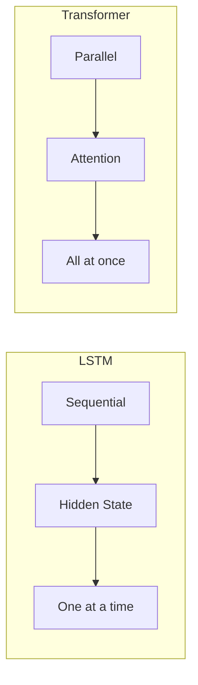

# Models

Neural network architectures for sequence-to-sequence translation.

## Overview

TorchLingo provides two model architectures:

| Model | Architecture | Use Case |
| ----- | ------------ | -------- |
| [`SimpleTransformer`](transformer.md) | Transformer with RoPE | Modern, best quality |
| [`SimpleSeq2SeqLSTM`](lstm.md) | LSTM encoder-decoder | Classic, simpler |

## Quick Comparison



| Feature | Transformer | LSTM |
| ------- | ----------- | ---- |
| Training speed | Fast (parallel) | Slow (sequential) |
| Long sequences | Handles well | Struggles |
| Memory | O(n²) | O(n) |
| Parameters | More | Fewer |
| Quality | Better | Good |

## Submodules

<div class="grid cards" markdown>

-   :material-lightning-bolt:{ .lg .middle } **Transformer**

    ---

    Modern encoder-decoder with multi-head attention and RoPE.

    [:octicons-arrow-right-24: Transformer Reference](transformer.md)

-   :material-memory:{ .lg .middle } **LSTM**

    ---

    Classic sequence-to-sequence with LSTM cells.

    [:octicons-arrow-right-24: LSTM Reference](lstm.md)

-   :material-sine-wave:{ .lg .middle } **Positional Encoding**

    ---

    Position embedding implementations including RoPE.

    [:octicons-arrow-right-24: Positional Reference](positional.md)

</div>

## Quick Start

### Transformer

```python
from torchlingo.models import SimpleTransformer

model = SimpleTransformer(
    src_vocab_size=10000,
    tgt_vocab_size=10000,
    d_model=512,
    n_heads=8,
    num_encoder_layers=6,
    num_decoder_layers=6,
)

# Forward pass
logits = model(src_batch, tgt_batch)
```

### LSTM

```python
from torchlingo.models import SimpleSeq2SeqLSTM

model = SimpleSeq2SeqLSTM(
    src_vocab_size=10000,
    tgt_vocab_size=10000,
    emb_dim=256,
    hidden_dim=512,
    num_layers=2,
)

# Forward pass
logits = model(src_batch, tgt_batch)
```

## Common Interface

Both models share a similar interface:

```python
# Training forward pass
logits = model(src, tgt)  # [batch, tgt_len, vocab_size]

# Encode only (for inference)
memory = model.encode(src)  # [batch, src_len, d_model]

# Decode with memory (for inference)
logits = model.decode(tgt, memory)
```

## Model Sizing Guide

### Tiny (Testing/Demo)

```python
config = Config(
    d_model=64,
    n_heads=2,
    num_encoder_layers=1,
    num_decoder_layers=1,
)
# ~500K parameters
```

### Small (Learning)

```python
config = Config(
    d_model=256,
    n_heads=8,
    num_encoder_layers=4,
    num_decoder_layers=4,
)
# ~15M parameters
```

### Medium (Production)

```python
config = Config(
    d_model=512,
    n_heads=8,
    num_encoder_layers=6,
    num_decoder_layers=6,
)
# ~65M parameters
```

## Saving and Loading

```python
import torch

# Save model
torch.save(model.state_dict(), "model.pt")

# Load model
model = SimpleTransformer(src_vocab_size, tgt_vocab_size)
model.load_state_dict(torch.load("model.pt"))

# For complete checkpoints (recommended)
torch.save({
    'model_state_dict': model.state_dict(),
    'optimizer_state_dict': optimizer.state_dict(),
    'epoch': epoch,
    'loss': loss,
}, "checkpoint.pt")
```

## GPU Usage

```python
device = torch.device("cuda" if torch.cuda.is_available() else "cpu")
model = model.to(device)

# Move data to device
src_batch = src_batch.to(device)
tgt_batch = tgt_batch.to(device)
```
