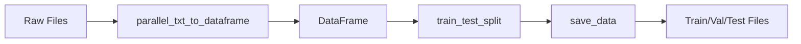

# Preprocessing

Data loading, tokenization, and preprocessing utilities for neural machine translation.

## Overview

The `preprocessing` module provides tools for:

- Loading data from various formats (TSV, CSV, JSON, Parquet)
- Converting parallel text files to DataFrames
- Splitting data into train/val/test sets
- SentencePiece tokenization
- Multilingual data handling

## Submodules

<div class="grid cards" markdown>

-   :material-file-document:{ .lg .middle } **Base Utilities**

    ---

    Core data loading and saving functions.

    [:octicons-arrow-right-24: Base Reference](base.md)

-   :material-text-box-multiple:{ .lg .middle } **SentencePiece**

    ---

    Subword tokenization utilities.

    [:octicons-arrow-right-24: SentencePiece Reference](sentencepiece.md)

-   :material-earth:{ .lg .middle } **Multilingual**

    ---

    Multi-language data handling.

    [:octicons-arrow-right-24: Multilingual Reference](multilingual.md)

</div>

## Quick Start

```python
from torchlingo.preprocessing import (
    load_data,
    save_data,
    parallel_txt_to_dataframe,
    train_test_split,
)

# Load from TSV
df = load_data("data/train.tsv")

# Convert parallel text files
df = parallel_txt_to_dataframe("en.txt", "es.txt")

# Save processed data
save_data(df, "data/processed.tsv")

# Split data
train_df, val_df, test_df = train_test_split(df, val_ratio=0.1, test_ratio=0.1)
```

## Key Functions

| Function | Purpose |
| -------- | ------- |
| [`load_data()`](base.md#torchlingo.preprocessing.base.load_data) | Load data from file |
| [`save_data()`](base.md#torchlingo.preprocessing.base.save_data) | Save DataFrame to file |
| [`parallel_txt_to_dataframe()`](base.md#torchlingo.preprocessing.base.parallel_txt_to_dataframe) | Convert .txt pair to DataFrame |
| [`train_test_split()`](base.md#torchlingo.preprocessing.base.split_data) | Split data into sets |

## Supported Formats

| Format | Extension | Notes |
| ------ | --------- | ----- |
| TSV | `.tsv` | Tab-separated, recommended for text |
| CSV | `.csv` | Comma-separated, quote text with commas |
| JSON | `.json` | JSON Lines format (one object per line) |
| Parquet | `.parquet` | Binary, efficient for large files |

## Data Requirements

All data files must have two columns:

- **`src`**: Source language text
- **`tgt`**: Target language text

```tsv
src	tgt
Hello world	Hola mundo
Good morning	Buenos días
```

## Typical Workflow



### Example

```python
from torchlingo.preprocessing import (
    parallel_txt_to_dataframe,
    train_test_split,
    save_data,
)
from pathlib import Path

# Convert raw parallel files
df = parallel_txt_to_dataframe(
    "raw_data/english.txt",
    "raw_data/spanish.txt",
)

# Split
train_df, val_df, test_df = train_test_split(
    df, 
    val_ratio=0.1, 
    test_ratio=0.1,
    shuffle=True,
)

# Save
data_dir = Path("data")
save_data(train_df, data_dir / "train.tsv")
save_data(val_df, data_dir / "val.tsv")
save_data(test_df, data_dir / "test.tsv")

print(f"Train: {len(train_df)}, Val: {len(val_df)}, Test: {len(test_df)}")
```
